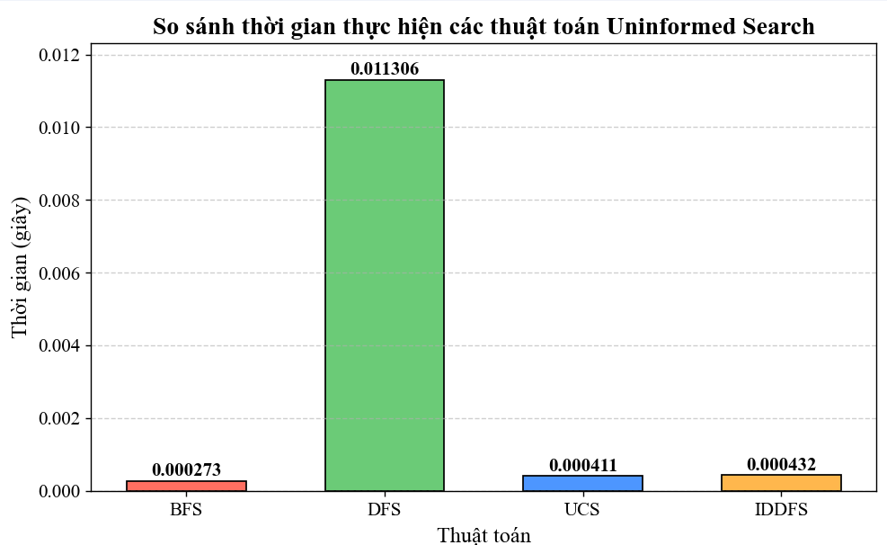

# 1. Mục tiêu
Mục tiêu chính của đồ án là tạo ra môi trường và chạy thử các thuật toán để so sánh cũng như đánh giá các thuật toán trong 6 nhóm thuật toán.
# 2. Nội dung
Trạng thái ban đầu (Initial State): Ma trận 3x3.

Tập hợp hành động (Actions): Di chuyển ô trống theo bốn hướng (trái, phải, lên, xuống).

Hàm kế tiếp (Transition Function): Khi thực hiện một hành động (di chuyển ô trống), trạng thái mới được tạo ra.

Trạng thái Mục tiêu (Goal State): Sắp xếp các ô số đúng thứ tự (thường là từ 1 đến 8 với ô trống ở cuối).
## 2.1. Các thuật toán Tìm kiếm không có thông tin

### 2.1.1. Breadth-First Search

#### 🎯 Ý tưởng thuật toán
      Thuật toán tìm kiếm BFS (Breadth-First Search) là một thuật toán duyệt theo chiều rộng. Nó ưu tiên kiểm tra các trạng thái liền kề trước khi mở rộng tìm kiếm sâu hơn.

#### ⚙️ Nguyên lý hoạt động
1. **Khởi tạo** trạng thái ban đầu, đánh dấu đã thăm.
2. **Đưa** trạng thái đầu vào **Hàng đợi**.
3. **Lấy** trạng thái ra khỏi **Hàng đợi**, kiểm tra xem có phải trạng thái đích.
4. Nếu **chưa đạt trạng thái đích**, tìm các trạng thái liền kề hợp lệ và đưa vào **Hàng đợi**.
5. **Lặp lại** quá trình từ bước 2 cho đến khi **Hàng đợi** rỗng.

#### ⏳ Độ phức tạp
- **Thời gian & Không gian:** $$O(b^d)$$
  - Với:
    - **b** là số trạng thái con trung bình.
    - **d** là độ sâu của trạng thái gần trạng thái mục tiêu nhất.

#### ✅ Ưu điểm
    ✔️ BFS đảm bảo tìm ra giải pháp có chi phí thấp nhất nếu trọng số là như nhau.  
    ✔️ Phù hợp với không gian trạng thái nhỏ và mục tiêu gần trạng thái ban đầu.  

#### ❌ Nhược điểm
    ⚠️ Yêu cầu bộ nhớ lớn khi không gian trạng thái rộng và độ sâu cao.  

#### 🛠 Ứng dụng
    - 📍 **Tìm đường đi ngắn nhất** không có trọng số.
    - 🧩 **Giải bài toán mê cung, trò chơi xếp hình, câu đố**.

### 2.1.2. Depth-First Search

#### 🎯 Ý tưởng thuật toán
      Thuật toán tìm kiếm DFS (Depth-First Search) là một thuật toán duyệt theo chiều sâu, đạt độ sâu tối đa. Nó ưu tiên kiểm tra các trạng thái theo chiều sâu trước khi mở rộng theo chiều ngang.

#### ⚙️ Nguyên lý hoạt động
1. **Khởi tạo** trạng thái ban đầu, đánh dấu đã thăm.
2. **Đưa** trạng thái đầu vào **Ngăn xếp**.
3. **Lấy** trạng thái ra khỏi **Ngăn xếp**, kiểm tra xem có phải trạng thái đích.
4. Nếu **chưa đạt trạng thái đích**, tìm các trạng thái liền kề hợp lệ và đưa vào **Ngăn xếp**.
5. **Lặp lại** quá trình từ bước 2 cho đến khi **Ngăn xếp** rỗng.

#### ⏳ Độ phức tạp
- **Thời gian:** $$O(b^d)$$
  - Với:
    - **b** là số trạng thái con trung bình.
    - **d** là **độ sâu tối đa** của không gian trạng thái.
- **Không gian:** $$O(b*d)$$
  - Với:
    - **b** là **số trạng thái con trung bình** của trạng thái cha
    - **d** là **số độ sâu của không gian** trạng thái
#### ✅ Ưu điểm
    ✔️ DFS **đảm bảo tìm ra giải pháp nhanh** nếu trạng thái đích ở nhánh sâu.  
    ✔️ Phù hợp với không gian trạng thái là **cây** hoặc **nằm sâu trong một nhánh**.  

#### ❌ Nhược điểm

    ⚠️ Dễ bị kẹt với **vòng lặp**.
    ⚠️ Nếu trạng thái đích **không nằm ở nhánh sâu**.

#### 🛠 Ứng dụng
    - 📍 **Phân tích cấu trúc đồ thị**
    - 🧩 **Giải bài toán mê cung, trò chơi xếp hình, câu đố, tìm kiếm đệ quy trong các bài toán xếp lịch**.

### 2.1.3. Uniform Cost Search

#### 🎯 Ý tưởng thuật toán
      Thuật toán tìm kiếm đường đi ngắn nhất dựa trên trạng thái và ước lượng chi phí thực tế cần để đến trạng thái đích, với bài toán thì giá trị thực tế càng nhỏ thì sẽ càng được ưu tiên

#### ⚙️ Nguyên lý hoạt động
1. **Khởi tạo** trạng thái ban đầu và tính đưa vào chi phí *(cost=0)*, đánh dấu đã thăm, đưa vào **hàng đợi ưu tiên**
2. Lấy giá trị chi phí và trạng thái ra khỏi **hàng đợi ưu tiên**, Kiểm tra xem có phải trạng thái đích
3. Tìm các trạng thái liền kề và tăng chi phí lên một của mỗi trạng thái
4. Tiếp tục quay lại bước 2 cho đến khi hàng đợi rỗng

#### ⏳ Độ phức tạp
- **Độ phức tạp không gian**$$O(b^{1+C/e})$$
  - Với **b** là số trạng thái con trung bình của 1 trạng thái, **C** là chi phí của đường đi tối ưu và **e** là chi phí để đi đến trạng thái con liền kề 
- **Độ phức tạp thời gian**$$O(b^{1+C/e})$$
  - Với **b** là số trạng thái con trung bình của 1 trạng thái, **C** là chi phí của đường đi tối ưu và **e** là chi phí để đi đến trạng thái con liền kề 
#### ✅ Ưu điểm
 ✔️ UCS **đảm bảo tìm ra giải pháp nhanh** nếu trạng thái đích ở tầng nông với chi phí thấp nhất.  
 ✔️ Phù hợp với *không gian trạng thái nhỏ* và cho các bài toán có tính toán **chi phí khác nhau**
#### ❌ Nhược điểm

    ⚠️ Có những hạn chế về không, thời gian như của BFS
    ⚠️ Với chi phí thay đổi thì có thể ưu tiên không chính xác

#### 🛠 Ứng dụng
    - Các bài toán tìm đường đi có trọng số
    - Lập kế hoạch có lợi nhất
    - Tối ưu hóa chi phí cho các bài toán

### 2.1.4. Iterative Deepening Depth-First Search

#### 🎯 Ý tưởng thuật toán
      Thuật toán DFS tìm kiếm theo độ sâu tăng dần, mỗi lần không tìm thấy trong độ sâu cho phép sẽ khởi động lại cho đến khi đạt được trạng thái cần tìm hoặc không còn trạng thái để tìm.

#### ⚙️ Nguyên lý hoạt động
1. Khởi tạo trạng thái đầu, độ sâu dự kiến cùng giá trị cho phép tăng
2. Thực hiện DFS với giá trị chặn độ sâu
3. Khi không tìm được trạng thái nhưng vẫn còn không gian tìm kiếm, tăng giá trị của độ sâu dự kiến và quay laij tìm kiếm lại từ đầu.
4. Tiếp tục cho lặp lại bước 2 cho đến khi hàng đợi rỗng
#### ⏳ Độ phức tạp

  **Thời gian:** $$O(b^d)$$ Tương tự ***BFS***, có thể sẽ chậm hơn một chút do phải lặp lại các mức nông nhiều lần.

  **Không gian:** $$O(bd)$$ Tương tự ***DFS***, vì chỉ cần lưu trữ một đường tìm kiếm tại một thời điểm.

#### ✅ Ưu điểm

✔️ **Có thể tìm được giải pháp**, nếu trạng thái đích tồn tại. **Sử dụng ít bộ nhớ hơn BFS, phù hợp với không gian trạng thái lớn.**

#### ❌ Nhược điểm
❌Lặp lại các trạng thái ở **mức nông nhiều lần**, dẫn đến chi phí tính toán cao hơn DFS hoặc BFS trong một số trường hợp.
Không hiệu quả nếu không gian trạng thái có chi phí không đồng nhất.
#### 🛠 Ứng dụng

Tìm kiếm trong các bài toán có **không gian trạng thái lớn** nhưng cần giải pháp nông nhất.
Các bài toán AI như giải câu đố hoặc tìm đường trong không gian trạng thái phức tạp.
Thay thế BFS khi bộ nhớ hạn chế.

### 2.1.5. So sánh thời gian chạy của các thuật toán

### Nhận xét

|Thuật toán|Hoàn chỉnh|Tối ưu|Độ phức tạp thời gian|Độ phức tạp không gian|Phù hợp khi|
|----------|------------|-------|------------------|----------------------|-----------|
|BFS|Có|Có (nếu chi phí đồng nhất)|𝑂(𝑏^𝑑)|O(b^d)|Giải pháp nông, không gian nhỏ|
DFS|Không (nếu xử lý chu kỳ)|Không|𝑂(𝑏d)|O(bd)|Giải pháp sâu, bộ nhớ hạn chế|
UCS|Có|Có|𝑂(𝑏^{1+[𝐶/𝜖]})|O(b^{1+[C/ϵ]})|Chi phí không đồng nhất
IDDFS|Có|Có (nếu chi phí đồng nhất)|O(𝑏^𝑑)|O(bd)|Giải pháp nông, bộ nhớ hạn chế

## 2.2. Các thuật toán Tìm kiếm có thông tin
### 2.2.1. A*

### 2.2.2. IDA*

### 2.2.3. Greedy

### So sánh thời gian chạy

### Nhận xét
| Thuật toán | Hoàn chỉnh | Tối ưu | Độ phức tạp thời gian | Độ phức tạp không gian | Phù hợp khi |
|------------|------------|------------|----------------------|----------------------|-------------|
| A*         | Có         | Có (nếu heuristic admissible) | O(b^d) | O(b^d) | Cần giải pháp tối ưu, heuristic tốt |
| IDA*       | Có         | Có (nếu heuristic admissible) | O(b^d) | O(b^d) | Cần giải pháp tối ưu, bộ nhớ hạn chế |
| Greedy     | Không      | Không      | O(b^m) | O(b^m) | Tốc độ ưu tiên, heuristic rất tốt |

## 2.3. Các thuật toán Tìm kiếm cục bộ
### 2.3.1. Simple Hill Climbing
### 2.3.2. Random Hill Climbing
### 2.3.3. Steepest Hill Climbing
### 2.3.4. Simulated Annealing
### 2.3.5. Genetic Algorithm
### 2.3.6. Beam Search

### So sánh thời gian chạy

### Nhận xét
| Thuật toán            | Hoàn chỉnh | Tối ưu                  | Độ phức tạp thời gian | Độ phức tạp không gian | Phù hợp khi                                      |
|-----------------------|------------|-------------------------|----------------------|----------------------|------------------------------------------------|
| Beam Search          | Không      | Không                   | O(β⋅b⋅d)             | O(β)                 | Không gian lớn, heuristic tốt, cần giải pháp nhanh |
| Genetic Algorithm    | Không      | Không                   | O(G⋅N⋅f)             | O(N)                 | Tối ưu hóa phức tạp, nhiều cực trị cục bộ         |
| Random Hill Climbing | Không      | Không                   | O(I⋅f)               | O(1)                 | Bài toán đơn giản, cần tốc độ                    |
| Steepest Hill Climbing | Không    | Không                   | O(I⋅b⋅f)             | O(b)                 | Không gian mượt, cần cải thiện cục bộ tốt        |
| Simple Hill Climbing | Không      | Không                   | O(I⋅k⋅f)             | O(1)                 | Cần tốc độ, chấp nhận giải pháp không tối ưu     |
| Simulated Annealing  | Có (lý thuyết) | Có (lý thuyết)       | O(I⋅f)               | O(1)                 | Nhiều cực trị cục bộ, cần giải pháp gần tối ưu   |

## 2.4. Các thuật toán Tìm kiếm trong môi trường phức tạp
Trình bày các thành phần chính của bài toán tìm kiếm là gì? Và solution là gì?
Hình ảnh gif của từng thuật toán áp dụng lên trò chơi
Hình ảnh so sánh hiệu suất của các thuật toán
Một vài nhận xét về hiệu suất của các thuật toán trong nhóm này khi áp dụng lên trò chơi 8 ô chữ (nếu có)
## 2.5. Các thuật toán Tìm kiếm có ràng buộc
Trình bày các thành phần chính của bài toán tìm kiếm là gì? Và solution là gì?
Hình ảnh gif của từng thuật toán áp dụng lên trò chơi
Hình ảnh so sánh hiệu suất của các thuật toán
Một vài nhận xét về hiệu suất của các thuật toán trong nhóm này khi áp dụng lên trò chơi 8 ô chữ (nếu có)
## 2.6. Các thuật toán học tăng cường
Trình bày các thành phần chính của bài toán tìm kiếm là gì? Và solution là gì?
Hình ảnh gif của từng thuật toán áp dụng lên trò chơi
Hình ảnh so sánh hiệu suất của các thuật toán
Một vài nhận xét về hiệu suất của các thuật toán trong nhóm này khi áp dụng lên trò chơi 8 ô chữ (nếu có)
## 3. Kết luận
Trình bày một số kết quả đạt đực trong project
