# 1. Mục tiêu
Mục tiêu chính của đồ án là tạo ra môi trường và chạy thử các thuật toán để so sánh cũng như đánh giá các thuật toán trong 6 nhóm thuật toán.
# 2. Nội dung
Trạng thái ban đầu (Initial State): Ma trận 3x3.

Tập hợp hành động (Actions): Di chuyển ô trống theo bốn hướng (trái, phải, lên, xuống).

Hàm kế tiếp (Transition Function): Khi thực hiện một hành động (di chuyển ô trống), trạng thái mới được tạo ra.

Trạng thái Mục tiêu (Goal State): Sắp xếp các ô số đúng thứ tự (thường là từ 1 đến 8 với ô trống ở cuối).
## 2.1. Các thuật toán Tìm kiếm không có thông tin

### 2.1.1. Breadth-First Search

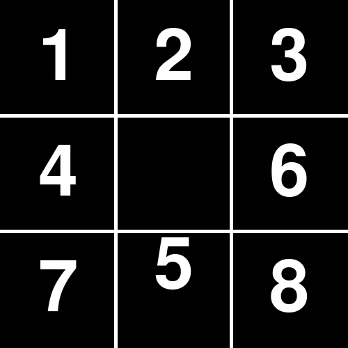

### 2.1.2. Depth-First Search

### 2.1.3. Uniform Cost Search

### 2.1.4. Iterative Deepening Depth-First Search

### 2.1.5. So sánh thời gian chạy của các thuật toán

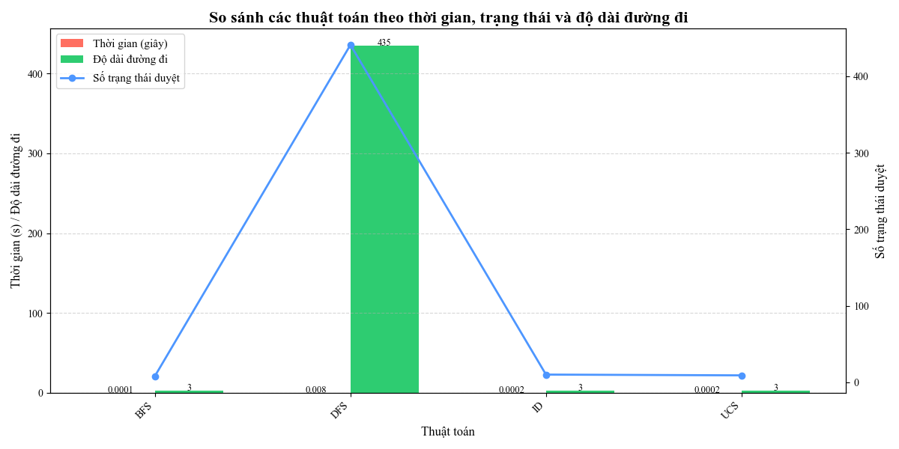

### Nhận xét

|Thuật toán|Hoàn chỉnh|Tối ưu|Độ phức tạp thời gian|Độ phức tạp không gian|Phù hợp khi|
|----------|------------|-------|------------------|----------------------|-----------|
|BFS|Có|Có (nếu chi phí đồng nhất)|𝑂(𝑏^𝑑)|O(b^d)|Giải pháp nông, không gian nhỏ|
DFS|Không (nếu xử lý chu kỳ)|Không|𝑂(𝑏d)|O(bd)|Giải pháp sâu, bộ nhớ hạn chế|
UCS|Có|Có|𝑂(𝑏^{1+[𝐶/𝜖]})|O(b^{1+[C/ϵ]})|Chi phí không đồng nhất
IDDFS|Có|Có (nếu chi phí đồng nhất)|O(𝑏^𝑑)|O(bd)|Giải pháp nông, bộ nhớ hạn chế

## 2.2. Các thuật toán Tìm kiếm có thông tin
### 2.2.1. A*
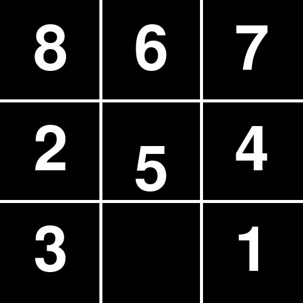

### 2.2.2. IDA*

### 2.2.3. Greedy
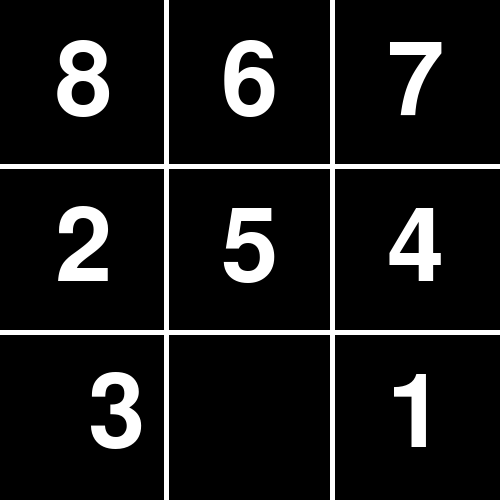

### So sánh thời gian chạy
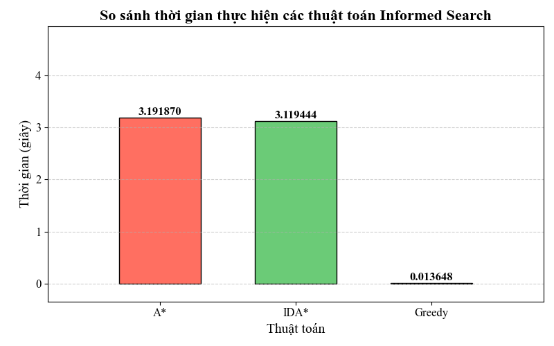

### Nhận xét
| Thuật toán | Hoàn chỉnh | Tối ưu | Độ phức tạp thời gian | Độ phức tạp không gian | Phù hợp khi |
|------------|------------|------------|----------------------|----------------------|-------------|
| A*         | Có         | Có (nếu heuristic admissible) | O(b^d) | O(b^d) | Cần giải pháp tối ưu, heuristic tốt |
| IDA*       | Có         | Có (nếu heuristic admissible) | O(b^d) | O(b^d) | Cần giải pháp tối ưu, bộ nhớ hạn chế |
| Greedy     | Không      | Không      | O(b^m) | O(b^m) | Tốc độ ưu tiên, heuristic rất tốt |

## 2.3. Các thuật toán Tìm kiếm cục bộ
### 2.3.1. Simple Hill Climbing
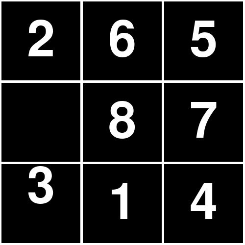

### 2.3.2. Random Hill Climbing
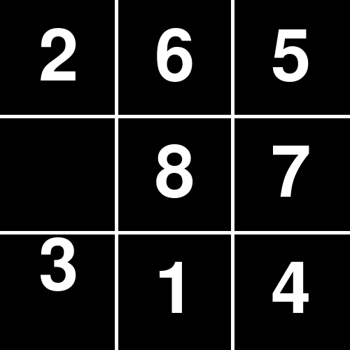

### 2.3.3. Steepest Hill Climbing

### 2.3.4. Simulated Annealing

### 2.3.5. Genetic Algorithm

### 2.3.6. Beam Search

### So sánh thời gian chạy
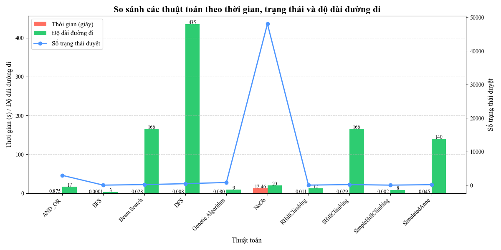

### Nhận xét
| Thuật toán            | Hoàn chỉnh | Tối ưu                  | Độ phức tạp thời gian | Độ phức tạp không gian | Phù hợp khi                                      |
|-----------------------|------------|-------------------------|----------------------|----------------------|------------------------------------------------|
| Beam Search          | Không      | Không                   | O(β⋅b⋅d)             | O(β)                 | Không gian lớn, heuristic tốt, cần giải pháp nhanh |
| Genetic Algorithm    | Không      | Không                   | O(G⋅N⋅f)             | O(N)                 | Tối ưu hóa phức tạp, nhiều cực trị cục bộ         |
| Random Hill Climbing | Không      | Không                   | O(I⋅f)               | O(1)                 | Bài toán đơn giản, cần tốc độ                    |
| Steepest Hill Climbing | Không    | Không                   | O(I⋅b⋅f)             | O(b)                 | Không gian mượt, cần cải thiện cục bộ tốt        |
| Simple Hill Climbing | Không      | Không                   | O(I⋅k⋅f)             | O(1)                 | Cần tốc độ, chấp nhận giải pháp không tối ưu     |
| Simulated Annealing  | Có (lý thuyết) | Có (lý thuyết)       | O(I⋅f)               | O(1)                 | Nhiều cực trị cục bộ, cần giải pháp gần tối ưu   |

**Ý nghĩa:**
- d: **Độ sâu của lời giải** (chiều dài đường đi đến mục tiêu).
- b: **Hệ số phân nhánh** (số lượng trạng thái kế tiếp trung bình từ mỗi nút).
- β (beta): Beam width – **số lượng nút được giữ lại ở mỗi mức trong Beam Search**.
- G: **Số thế hệ** (generations) trong thuật toán di truyền.
- N: **Kích thước quần thể** (population size) trong thuật toán di truyền.
- f: **Thời gian tính toán hàm đánh giá** (fitness function).
- I: **Số lần lặp tối đa** hoặc số bước tối đa cho thuật toán leo đồi hoặc mô phỏng tôi luyện.
- k: Số lượng bước nhảy hoặc lựa chọn có thể kiểm tra từ mỗi trạng thái trong Simple Hill Climbing.

## 2.4. Các thuật toán Tìm kiếm trong môi trường phức tạp
### 2.4.1. Search with Nondeterministic Actions
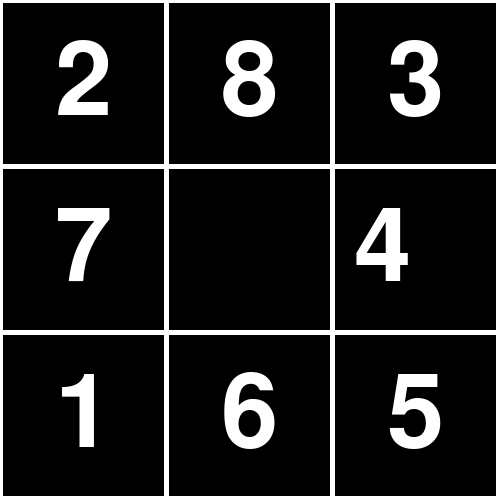

### 2.4.2. Searching with no observation
***Chưa làm được Animation với thiết kế hiện tại.***
### 2.4.3. Searching in partially observable environments
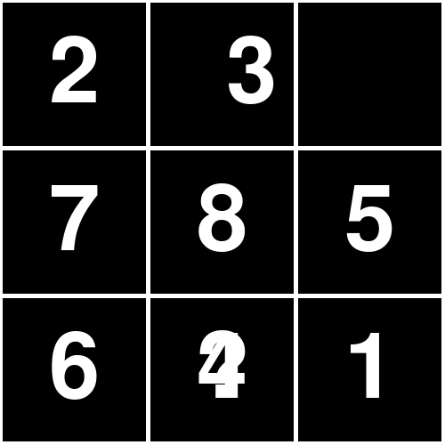

### So sánh thời gian chạy
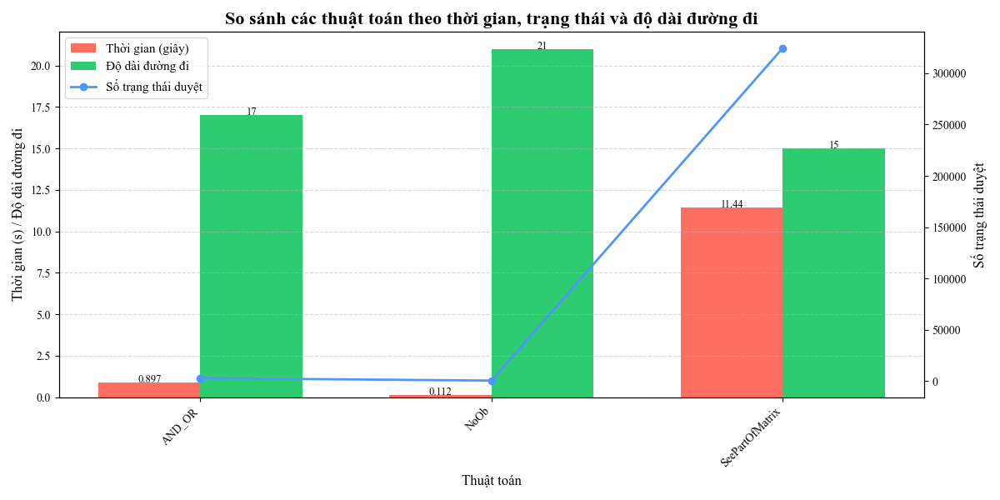

### Nhận xét về các thuật toán SeePartOfMatrix, AND_OR, No Observation

| Thuật toán            | Hoàn chỉnh | Tối ưu | Độ phức tạp thời gian | Độ phức tạp không gian | Phù hợp khi |
|-----------------------|------------|--------|-----------------------|-------------------------|-------------|
| **CSP + AStar**          | Có (với giới hạn) | Có (với heuristic admissible) | O(`max_csp_states` * b^d) | O(b^d) | Bài toán 8-puzzle với trạng thái ban đầu không đầy đủ, cần lời giải tối ưu |
| **AStar AND-OR**  | Không rõ ràng | Có (trong một số trường hợp) | O(b^d) (có thể cao hơn) | O(b^d) | Bài toán 8-puzzle với di chuyển xác suất hoặc hành động không chắc chắn |
| **AStar_No Observation** | Có (với tập niềm tin hữu hạn) | Không | O(b^d * \|B\|) | O(b^d * \|B\|) | Bài toán 8-puzzle với trạng thái ban đầu không xác định, được biểu diễn bằng tập niềm tin |

### Ghi chú
- `b`: Số nhánh trung bình (số trạng thái kế tiếp, tối đa 4 trong 8-puzzle tiêu chuẩn, cao hơn trong **Hybrid A* AND-OR** do nhảy).
- `d`: Độ sâu của lời giải (số bước cần thiết để đến mục tiêu).
- `|B|`: Kích thước tập niềm tin trong **A* No Observation**.

## 2.5. Các thuật toán Tìm kiếm có ràng buộc
### 2.5.1. Thuật toán tìm kiếm có ràng buộc dùng Backtracking.
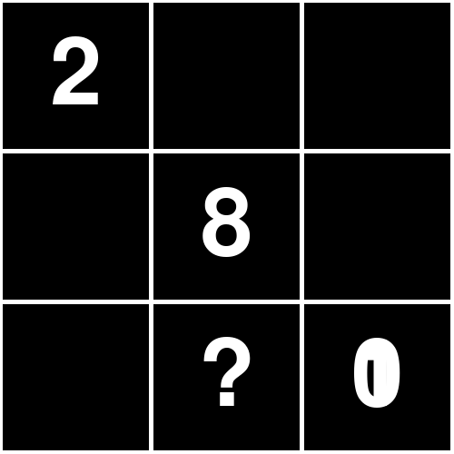

### Đánh giá thuật toán
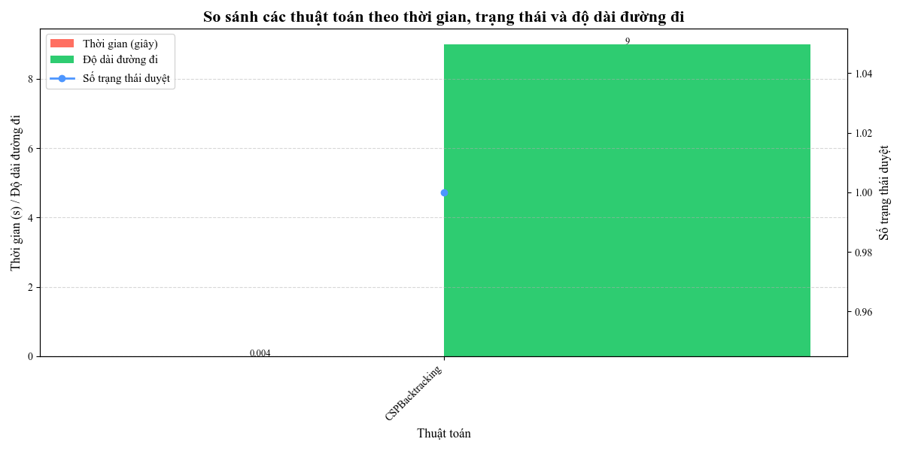

### Nhận xét
| Thuật toán            | Hoàn chỉnh | Tối ưu | Độ phức tạp thời gian | Độ phức tạp không gian | Phù hợp khi |
|-----------------------|------------|--------|-----------------------|-------------------------|-------------|
| **CSP Backtracking**  | Có (với miền hữu hạn) | Không | O(9!) | O(9) (đệ quy) | Tạo trạng thái ban đầu ngẫu nhiên hợp lệ cho bài toán 8-puzzle, không cần đường đi tối ưu |

## 2.6. Các thuật toán học tăng cường
### 2.6.1. QLearning
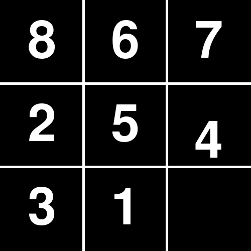

### Đánh giá thuật toán
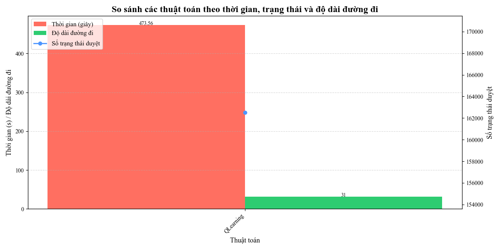

### Nhận xét
| Thuật toán            | Hoàn chỉnh | Tối ưu | Độ phức tạp thời gian   | Độ phức tạp không gian | Phù hợp khi                                          |
|-----------------------|------------|--------|------------------------|------------------------|--------------------------------------------------|
| **Q-learning**        | Không      | Không  | O(episodes ⋅ maxSteps) | O(states ⋅ actions)   | Học tăng cường, cần nhiều vòng lặp để tối ưu        |
### **Ý nghĩa các ký hiệu**
- **episodes**: Số vòng huấn luyện Q-learning.
- **maxSteps**: Số bước tối đa trong mỗi tập huấn luyện.
- **states**: Tổng số trạng thái có thể có trong bài toán.
- **actions**: Số lượng hành động có thể thực hiện tại mỗi trạng thái.
- **b**: Hệ số phân nhánh (số trạng thái kế tiếp trung bình).
- **d**: Độ sâu của lời giải.

## 3. Kết luận
Áp dụng thuật toán của sáu nhóm thuật toán thành công nhưng một số cách viết có thể không thể tìm ra đáp án do môi trường không ổn định, có thể môi trường sẽ khó vẽ do cách vẽ màn hình.